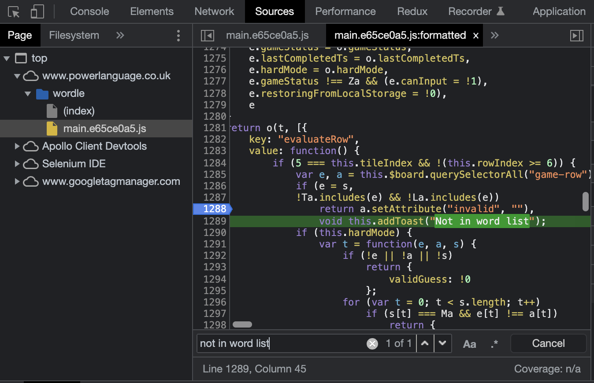

# Hacking Wordle

Do you recently see something like this on twitter:

```txt
Wordle 221 4/6

⬛⬛⬛⬛⬛
🟨🟨⬛⬛⬛
⬛⬛🟩🟩🟨
🟩🟩🟩🟩🟩
```

These are the results from the online word game
["wordle"](https://www.powerlanguage.co.uk/wordle/) which got some attention
recently.

The game play is very simple: You have to guess a five character word. After
each guess the game will give you hints:

- Characters that are not in the solution
- Characters that are in the solution but not at the position as in your guess
- Characters that are in the solution and at the right position of your guess.

With this hints you have to find the word in at most six tries.

Since I'm not a native (english) speaker - as you might noticed - I recognized
that my vocabulary is pretty limited. So I decided to
do a little bit of research on how to narrow the solution with code instead of
my limited vocabulary.

## The Idea

The idea is pretty simple:

1. Find a list of english words with five letters
2. Create a letter count for each letter index
3. Create a score for each word how likely it could be the solution
4. Filter the words with the hints from the wordle game to narrow the solution

so don't let's hesitate.

## Find a Wordlist

If you search things like "n common englisch words .txt" you would probably find
a lot. The only problem i had was that it could not be "in sync" with wordle.
So I could end up with a suggestion that is not even possible in wordle. Wordle
itself complains when you enter a guess that is "Not in word list" so I thought:
This list must be either loaded via HTTP-Request or statically hardcoded in the
JavaScript sources. Fortunately we have cool things like the devtools.

<figure>
    
    <figcaption>Screenshot from chrome dev tools showing the entrypoint to find
    wordles word list</figcaption>
</figure>

In the "_source_" tab in dev tools we can find a _main.\*.js_ file in which we
can search for "_not in word list_" (This message is shown in a popup when you
guess a word which is not in the wordlist). In the line before we can see a
condition statement which checks `Ta` or `La` includes `e`. You can set a
breakpoint there and enter some senseless guess ("abcde" e.g.) to make some
interesting observations:

- `e` is the guess you made
- `Ta` and `La` are list of words

So here we are and we have our word lists.... Wait! Way we found two lists? If
you look closely two points are strinking:

- They have very different lengths (10657 vs. 2315)
- The larger list seems to be ordered (from a to z) while the second seems to
  be in random order

To make it short: The second list is the solution list and the wordle number
(which you can see when you share your result) is the index in this array. So
from my example from the beginning it would be:

```js
La[221]; // 'whack'
```

So if you want, you could stop here and impress your follower everyday with:

```
Wordle n 1/6

🟩🟩🟩🟩🟩
```

(make sure not to retweet this post before 😉).

If you want to go further you could save the word into an .txt file. Just
execute this snippet in the dev tools console when you hit the breakpoint

```js
console.log(La.concat(Ta).join("\n"));
```

Dev tools will offer you to copy the printed list so from that point it will be
easy to save it into `words.txt`.

## Create a letter count

To process the word list I'm using python.

```python
from collections import Counter

def get_lines(file: str):
    with open(file, 'r') as file:
        lines = file.readlines()
    return lines

matrix = [list(word.strip()) for word in get_lines('words.txt')]
matrix_t = [list(word) for word in zip(*matrix)]

char_counts = [Counter(word) for word in matrix_t]
```

In this snippet I first define a helper to read file contents as a string array.
Than we define a matrix which stores each word as an array of charaters. To
create a count for each character at each index we need a list of characters
per index or in other words the transposed from of `matrix` which we store
in `matrix_t`.

`matrix [n_words x 5]`

```js
[
  ["a", "b", "c", "d", "e"],
  ["f", "g", "h", "i", "j"],
  ["k", "l", "m", "n", "o"],
  ["p", "q", "r", "s", "t"],
  ["u", "v", "w", "x", "y"],
  // ...
];
```

`matrix_t [5 x n_words]`

```js
[
  ["a", "f", "k", "p", "u" /* ... */],
  ["b", "g", "l", "q", "v" /* ... */],
  ["c", "h", "m", "r", "w" /* ... */],
  ["d", "i", "n", "s", "x" /* ... */],
  ["e", "j", "o", "t", "y" /* ... */],
];
```

So we can now iterate over matrix_t and apply pythons [Counter class](https://docs.python.org/3/library/collections.html#collections.Counter)
to the character list.

The Counter makes it easy to query some statistics:

```python
char_counts[0].most_common(5)
# [('s', 1565), ('c', 922), ('b', 909), ('p', 859), ('t', 815)]
```

In this example we can see that `s` is by far the most common starting letter
followed by `c`, `b` and so on.

## Create a word score

With this counts we are able to create a very simple scoring model where we sum
up the count of each letter at its position.
Lets take the word `whack` (solution of wordle 221) as an example:

| Pos | Letter  | Score |
| --- | --------| ----: |
| 0   | w       |   413 |
| 1   | h       |   546 |
| 2   | a       |  1236 |
| 3   | c       |   411 |
| 4   | k       |   259 |
|     | **Sum** |_2865_ |

So whack would have a score of 2865. With this model we can create a list
of the "best words" to start:

| Score | Word  |
| ----- | ----- |
| 11144 | sores |
| 11077 | sanes |
| 10961 | sales |
| 10910 | sones |
| 10794 | soles |

Of course there are plenty of improvements to the whole model.
Right now it doesn't consider the relation between single letters
(does words that starts with a `s` are likely to end with `s` or
more likely with another letter?).

## Filter the word list

Now we have a list of words and can give each word a value, we should filter out
the words that can definitly not be the solution based on the hints from wordle.

<figure>
    
    <figcaption>Screenshot of a guess in the Wordle
    game with the hints from the game</figcaption>
</figure>

In the example above wordle tells us that 

## The tool

Finally we need to filter the list of best words since we can't expect
_sores_ to be the solution all the time. So we need to apply the hints we
got from the game as filters to our list.

<div id="suggestion-form"></form>
